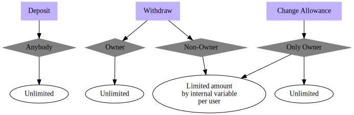

# Simple Shared Wallet

## Description

This Shared Wallet Smart Contract was built for a code challenge
of the [Solidity Course](https://www.udemy.com/course/blockchain-developer) from Udemy.

## Diagram

Here is the diagram chart of this project:

## How to run

Deploy `SharedWallet.sol`.
